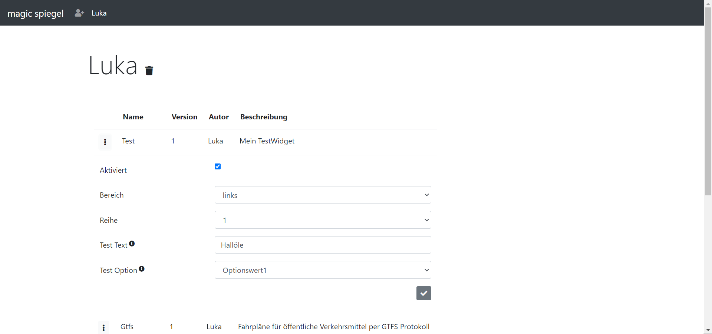

# magicspiegel
a modular, customizable smart mirror using face recognition!
<br><br>

## what is a smart mirror?
A smart mirror presents widgets to the user. This is done by using a flat screen behind a spy mirror. The screen must be completely black, so that the mirror reflects all light. The only bright widgets are visible on the front.
<br><br>

## why did I start this project?
Because I did not find any existing smart mirror project with face recognition. Also because I wanted to try out electron.
<br><br>

## anything else?
magicspiegel is under construction. Many things are not in their final state. Especially the configuration website is implemented highly provisionally. Contribution is highly appreciated! Also, feel free to build own widgets!

# the project

## what it does
The project runs an electron app which continously detects faces. This is done by using [justadudewhohacks tensorflow based face-api.js](https://github.com/justadudewhohacks/face-api.js/).
<br><br>
Users can register via a web frontend. The page is hosted via [express](https://github.com/expressjs/express) inside a electron renderer process. Communication between the frontend and the main app is done using the database and inter process communication.
<br><br>

<br><br>

If a face is detected, the descriptors are compared to the database. If a registered user is identified, his profile (his selected widgets and personal widget settings) are loaded. 
<br><br>

<br>
Note that the black area is where the user sees himself inside the mirror :)
<br><br>


## how it works
The application is divided into two processes: the main process, which runs the mirror and a renderer process, which runs a express webserver instance to host the configuration frontend.

The mirror is divided into services:<br><br>
[``dataadapter``](./src/services/dataadapter.ts)<br>
The DataAdapter is the interface to the database. It provides repositories for all data types. The database itself is sqlite.<br><br>
[``facerecognitionservice``](./src/services/facerecognitionservice.ts)<br>
This is a wrapper for faceapi.js. It detects faces and compares them to stored face descriptors in the database. If a user is identified, it notifies the MirrorService via events.<br><br>
[``mirrorservice``](./src/services/mirrorservice.ts)<br>
This is the main "worker" which will present widets to the user and decide when to load a new profile.
<br>


## how to run it
1. Clone the project

2. Restore all dependencies <br>
``npm install``

3. Rebuild the packages for electron as documented [here](https://github.com/electron/electron-rebuild)<br>
Linux: ``$(npm bin)/electron-rebuild``
Windows:``.\node_modules\.bin\electron-rebuild.cmd``

4. Run the app<br>
``npm start``
<br><br>

## how to contribute
As I mentioned, contribution would be highly appreciated. Feel free to create a pull requests or open issues. The code is (more or less) documented.
<br><br>

# Developing a Widget
Creating own widgets is very easy. Instanciation, presentation and the presentation of the variable settings (which the user can configure) is done by the mirror. To make that work, your widget has to extend the base class [``Widget``](./src/widgets/widget.ts). If your widget has configurable settings, you also have to create a class Widget*Settings.ts, which extends the settings base class [``WidgetSettings``](./src/widget/widgetsettings.ts).

You can compare the steps below to the [testwidget](./src/widgets/widget_test.ts)<br><br>

## how widgets are registered
On startup, the MirrorService will load all .js files titled Widget_*.js inside the widget directory. The widget must export a factory which will allow the mirror to create an instance.<br>

The Mirror Service will also store all widget settings as configurable elements in the database.
<br><br>

## how widgets are presented to the user
The user can enable the widget on the webinterface. He can also configure the widget according to the configurable settings specified in the Settings class.

If the registered user looks into the mirror and his face gets recognized, the database gets queried for his enabled widgets and his user specific settings. A Widget*Settings object is created from the data and is passed to the widget along with the containing parent Div. Then the Widget base classes load function is called.

## Sample widget
Following widget "Test" will present a message, which the user can configure on the web interface:



I enabled the widget, set it to the upper left corner and set the presentation value to "Hallöle".

Once my face is recognized, the mirror will show:


Note that the black area will be reflected by the mirror and only the white widet text will be visible.
<br><br>
## 1. Setup the files

We create a new Directory ``Widget_Test`` inside our Widget directory. Inside that we create the files ``Widget_Test.ts``, ``Widget_Test_Settings.ts`` and ``export.ts``.

```
.
├── ...
├── src
│   ├── Widgets                      # Where our widgets live
│   │   ├── Widget_Test              # One folder per widget
│   │   │   ├── Widget_Test.ts       # The widget class with all logic and code
│   │   │   ├── Widget_Settings.ts   # The settings class, which will make the widget configurable
│   │   │   ├── export.ts            # The exported factory
```
<br>

## 2. Define the settings class

The settings class must extend the abstract class WidgetSettings. This will make sure, that the user configure the values ``Enabled``, ``Div`` and ``Row``. The class is also used by the mirror service to store all setting items in the database.

```
import { WidgetSettings, WidgetSettingsItem, WidgetSettingsItemType } from "../WidgetSetting";
import * as Data from "../../Services/export";

export class TestWidgetSettings extends WidgetSettings {

    public TestText: string;
    public TestOption: string;
        
    constructor() {
        super([
            new WidgetSettingsItem("TestText", "Test Text", "Dies ist nur ein Test", false, WidgetSettingsItemType.TEXT, null, "TestWert"),
            new WidgetSettingsItem("TestOption", "Test Option", "Dies ist auch nur ein Test", false, WidgetSettingsItemType.OPTION, "Optionswert1|Optionswert2", null)
        ]);
    }
}
```

For each setting item we must pass a defition to the constructor of WidgetSettings. This will probably change to annotations / decorators in the future.

The signature of the WidgetSettings constructor reads as follows:
```
constructor(key: string, friendlyName: string, description: string, readOnly: boolean, type: WidgetSettingsItemType, options: string, presetValue: any)
```

As you can see, this corresponds to the display on the user interface.
<br><br>

## 3. Define the widget

The Widget class must extend the base class ``Widget``. This will make sure the widget provides basic metadata information which is presented to the user on the web interface. The base class will also handle the widget creation, since it will listen to the currentUserChangedEvent of the mirror service. It will also query the database for the corresponding WidgetSettings object.

All the widget developer has to do, is to overwrite the abstract functions ``Load()`` (when the user first looks into the mirror) and ``Refresh()`` (when the same user looks into the mirror after a time threshold).

```
import * as Services from "../../Services/export";
import { Widget } from "../Widget";
import { TestWidgetSettings } from "./Widget_Test_Settings";

export class Test extends Widget {

    constructor(dataAdapter: Services.DataAdapter, mirrorService: Services.MirrorService){
        
        super(
            new TestWidgetSettings(), 
            dataAdapter,
            mirrorService, 
            "Test", 
            1,
            "Mein TestWidget", 
            "Luka"
        );
    }

    public Load(): void {
        
        this.Div.innerHTML += `<div style="font-size:45px; color:white">${(<TestWidgetSettings>this.WidgetSettings).TestText}</div>`;
    }

    public Refresh(): void {
        
    }
}
```

As you can see, we pass our meta data to the base classes constructor. In the ``Load()`` method, we simply read the configured value ``TestText`` and display it in the Div. The property ``Div`` is part of the base class and will be overwritten once the ``Load()`` method is called.


